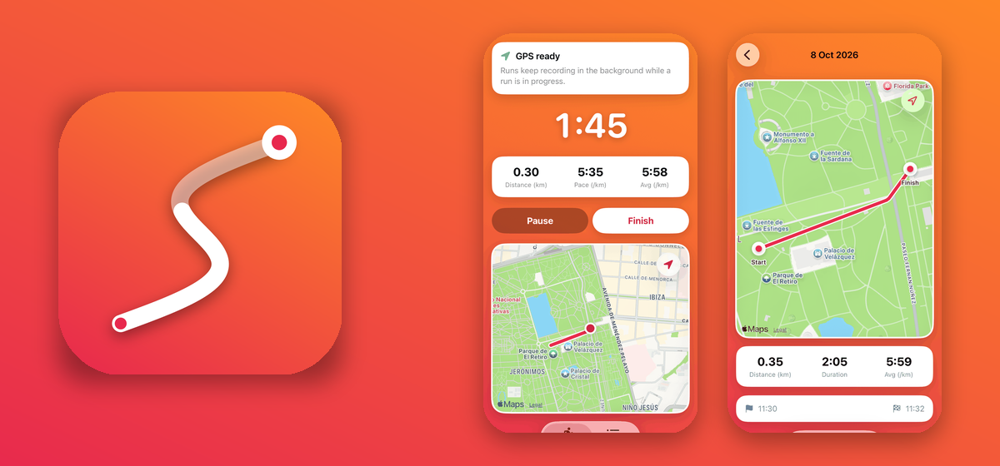
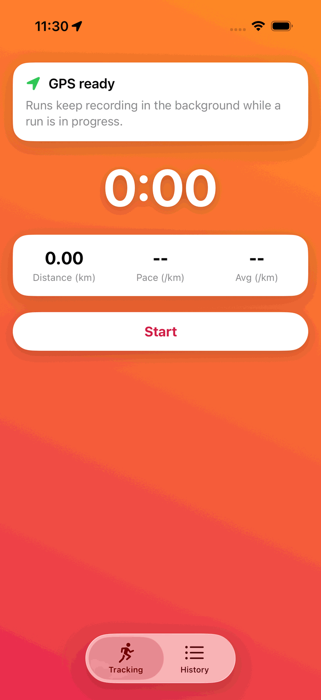
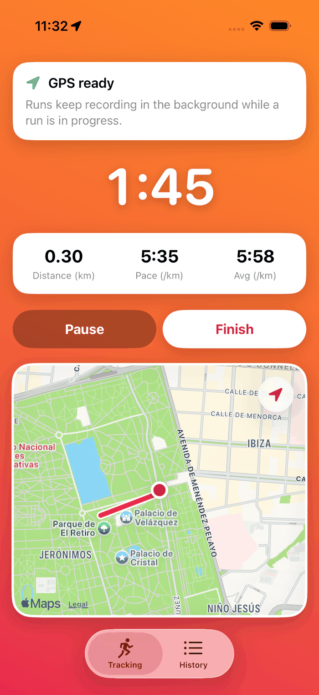
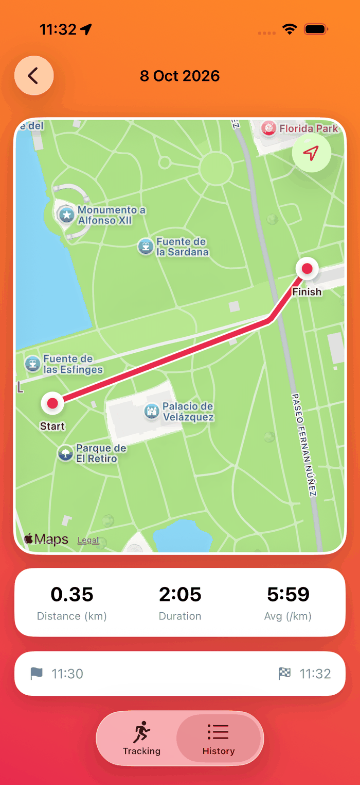
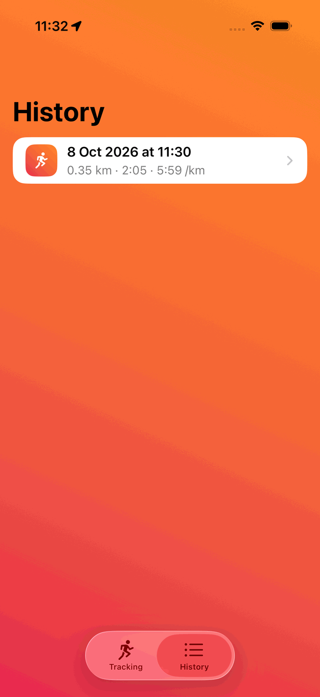
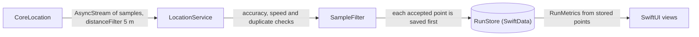

<div align="center">

# STRIDE

**A native iOS running tracker that records GPS runs reliably, even in the background.**


[Try it](#how-to-try-it) · [Screenshots](#screenshots) · [Documentation](#documentation)

<a href="#screenshots">
  
</a>

</div>

STRIDE records a run with CoreLocation, filters out GPS noise, saves every point as it arrives and draws the route with MapKit. What sets it apart is that the persisted store, not the UI, is the source of truth for a run, so a run survives screen lock, backgrounding and a killed process. There is no public demo and no App Store or TestFlight build: you build it from source.

## What it includes

- **Live tracking:** start, pause, resume and finish a run with elapsed time, distance, current pace and average pace.
- **Filtered GPS:** samples with poor accuracy, impossible jumps or duplicates never reach the distance or the route.
- **Background recording:** a run keeps recording with the screen locked, using the `location` background mode only while a run is active.
- **Recovery:** points are written one by one, so an interrupted run is restored as paused and can be resumed or finished.
- **History and route maps:** completed runs are listed and open on a MapKit map with start and finish markers.

## How to try it

Requirements: macOS with Xcode (iOS 18+ simulator) and [XcodeGen](https://github.com/yonaskolb/XcodeGen). The Xcode project is generated from `project.yml` and is not committed.

```bash
brew install xcodegen
xcodegen generate
xcodebuild test -project STRIDE.xcodeproj -scheme STRIDE \
  -destination 'platform=iOS Simulator,name=iPhone 17 Pro'
```

This generates the project and runs the unit tests in the simulator; it does not install or distribute anything. To see the app, open `STRIDE.xcodeproj` in Xcode and run the `STRIDE` scheme. The simulator has no GPS, so simulate a route with Xcode's **Debug → Simulate Location** or the simulator's **Features → Location** menu. Use any installed simulator name if `iPhone 17 Pro` is not available.

## Screenshots

Captured from the app in the iPhone 17 Pro simulator with a synthetic route in the Retiro park (Madrid). Click an image to open it at full size.

<table>
  <tr>
    <td align="center" width="50%">
      <b>Ready to run</b><br>
      <a href="docs/screenshots/01-tracking-idle.png"></a>
    </td>
    <td align="center" width="50%">
      <b>Run in progress</b><br>
      <a href="docs/screenshots/02-tracking-active.png"></a>
    </td>
  </tr>
  <tr>
    <td align="center" width="50%">
      <b>Run details</b><br>
      <a href="docs/screenshots/03-run-details.png"></a>
    </td>
    <td align="center" width="50%">
      <b>History</b><br>
      <a href="docs/screenshots/04-history.png"></a>
    </td>
  </tr>
</table>

The screenshots are in light mode only. How to recapture them and rebuild the cover is described in [`docs/screenshots/README.md`](docs/screenshots/README.md).

## Architecture



`LocationService` owns `CLLocationManager`, authorization and the background configuration, and turns each `CLLocation` into a plain `LocationSample`. `TrackingCoordinator` is created by the app, not by a view: it pushes samples through `SampleFilter` and the run state machine and writes every transition and accepted point to the `RunStore` before it counts as part of the run. SwiftUI only renders that state and forwards intents (start, pause, resume, finish), so recreating a view or relaunching the process cannot lose a run.

## Decisions

| Decision | Why | Cost |
|----------|-----|------|
| `Best` accuracy with a 5 m `distanceFilter` | Keeps a usable route without one update per second; the simulation shows it halves updates compared with no filter ([PERFORMANCE](docs/PERFORMANCE.md)). | Higher GPS radio cost than coarser settings; battery was not measured, and 10 m is the next candidate to test on a device. |
| Persisted store as the source of truth | An interrupted run is recovered from disk instead of from memory. | Every accepted point is a write, and recovery adds a state (restored as paused) the user must resolve. |
| Local SwiftData, no backend | Nothing to deploy, works offline, keeps location data on the device. | No sync, no backup, no sharing between devices. |
| Reject samples instead of smoothing them | Distance can only come from points that passed explicit, testable rules (30 m accuracy, 12 m/s, 1 m duplicates). | A genuinely fast or imprecise stretch is dropped, so the route can show gaps. |
| No keep-alive tricks, `location` background mode only | Respects the iOS execution model instead of fighting it. | If iOS kills the app, the time it was not running is a gap in the route (see [BACKGROUND](docs/BACKGROUND.md)). |
| Opaque cards on the icon's gradient | Text keeps the system contrast in light and dark mode. | Less of the system's translucent look. |

## Quality

Last run on 2026-10-08, iPhone 17 Pro simulator (iOS 26.4): **165 tests in 18 suites passed** in about 2 seconds. They use Swift Testing with deterministic input and an injected clock, and cover distance, pace, GPS filtering, the run state machine, permission loss, recovery after a relaunch and background configuration. A seeded simulation compares CoreLocation configurations through the real filter and metrics ([PERFORMANCE](docs/PERFORMANCE.md)).

The XCUITest in `STRIDEUITests` walks through a synthetic run to capture the screenshots. It is not a regression suite: it asserts only that the app reaches each screen, it takes about 2.5 minutes, and it has its own `STRIDEScreenshots` scheme so the default test run stays fast.

Not tested:

- **Physical device.** Real GPS error, background suspension, kills by the OS and permission changes from Settings were not exercised; the simulator does not behave like iOS on hardware.
- **Battery.** No measurement was made. The manual protocol in [PERFORMANCE](docs/PERFORMANCE.md#manual-protocol-on-a-device--not-executed) has not been run.
- **CI.** No automated pipeline exists; tests are run locally.

## Limits

- No App Store, TestFlight or downloadable build; it is built from source.
- Foreground and background recording is verified with deterministic tests, not with outdoor runs.
- If the process is killed, STRIDE does not relaunch itself (no significant-location-change or region monitoring), so a gap appears until the user opens the app.
- Out of scope: social features, Apple Watch, HealthKit, heart-rate sensors, third-party integrations and any backend ([PRODUCT](docs/PRODUCT.md)).
- English-only interface text; screenshots in light mode only.

## Documentation

[Product](docs/PRODUCT.md) · [Architecture](docs/ARCHITECTURE.md) · [Data model](docs/DATA_MODEL.md) · [GPS filtering](docs/GPS_FILTERING.md) · [Background tracking](docs/BACKGROUND.md) · [Reliability](docs/RELIABILITY.md) · [Maps](docs/MAPS.md) · [Metrics](docs/METRICS.md) · [History](docs/HISTORY.md) · [Design](docs/DESIGN.md) · [Performance](docs/PERFORMANCE.md) · [Screenshots](docs/screenshots/README.md)

## License

[MIT](LICENSE) © 2026 David Rodríguez
